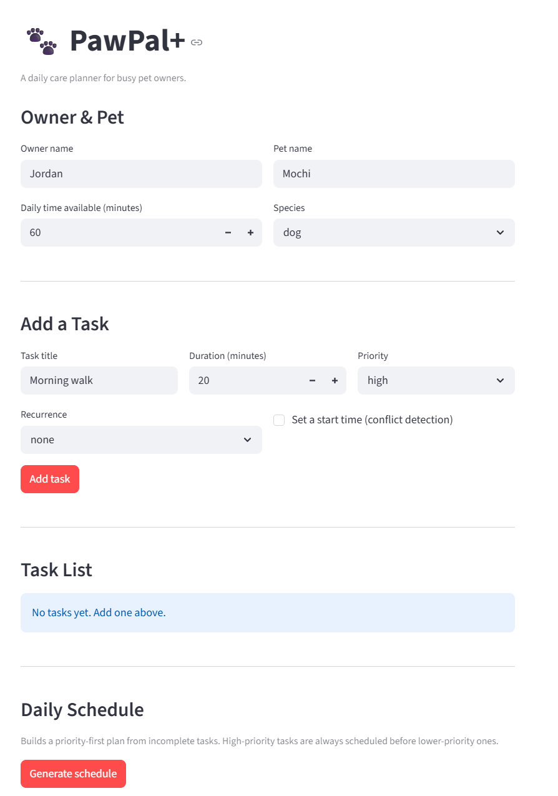

# PawPal+

PawPal+ is a Streamlit application and Python scheduling engine for daily pet care planning. It helps a pet owner capture care tasks, manage recurring work, detect timing conflicts, and build a day plan that respects limited available time.

The project is split into a UI layer in `app.py`, a scheduling domain model in `pawpal_system.py`, and a pytest suite in `tests/test_pawpal.py`.

## 📸 Demo



## Features

- Streamlit dashboard for owner and pet setup, task entry, task review, filtering, sorting, completion, removal, and schedule generation.
- Priority-first greedy scheduling: `generate_plan()` filters out completed tasks, sorts remaining tasks by priority (`1` highest, `3` lowest), breaks ties by shortest duration first, and accepts each task if it fits within the remaining time budget.
- Exact-fit support: tasks that match the remaining available minutes exactly are included in the plan.
- Conflict detection with interval overlap logic: `detect_conflicts()` converts `start_time` values to minutes since midnight and flags overlaps while correctly ignoring back-to-back tasks.
- Cross-pet conflict detection in the backend: `detect_conflicts(other=...)` can compare schedules across two pets owned by the same person.
- Recurring task regeneration: completing a `daily` or `weekly` task creates the next occurrence with the correct due date using `timedelta`.
- Duplicate protection: `add_task()` blocks duplicate incomplete task names while still allowing a task name to be reused after the prior task is completed.
- Filtering and sorting utilities: the backend supports filtering by completion state and pet name, and the UI supports sorting by default priority order or shortest duration.
- Clear schedule outputs: the UI shows time-budget metrics, scheduled tasks, excluded tasks, and conflict warnings so the result is easy to review.
- AI Reliability Evaluation: built-in checks verify that the AI Assistant returns correct structured actions, avoids unnecessary Gemini calls, and handles quota errors safely.
- AI Assistant with local-first parsing: most task commands (add, remove, complete, list) are handled locally with zero API calls. Gemini is used only as a lightweight intent classifier for ambiguous requests. All user-facing messages are generated locally.

## How It Works

### Core data model

- `Owner` stores the owner's name and daily time available.
- `Pet` stores the pet's basic identity.
- `Task` stores the task name, duration, priority, completion state, recurrence, optional due date, and optional start time.
- `Scheduler` owns the task list and contains the scheduling, filtering, recurrence, and conflict-detection logic.

### Scheduling algorithm

The planner uses a greedy algorithm. It evaluates incomplete tasks in priority order, breaks ties by shortest duration, and adds tasks one by one while the total stays within the owner's time limit. This makes the schedule predictable and ensures higher-priority work is considered first, even if that can leave some unused time.

### Conflict algorithm

When a task has a `start_time`, the scheduler treats it as a time window `[start, end)`. Two tasks conflict only when those windows overlap. This means a task ending at `07:10` and another starting at `07:10` are not treated as a conflict.

### AI Assistant

The AI Assistant uses a local-first architecture. Most requests — adding tasks, removing tasks, marking tasks complete, listing tasks — are parsed locally using regex-based intent matching with zero Gemini API calls. Natural phrasing like "I need to walk my dog. It will take 30 minutes and is medium priority" is handled entirely offline. When local parsing cannot determine the intent, Gemini acts as a lightweight classifier only: a minimal prompt (~200 tokens) asks it to return an action name and extracted fields, not prose. All user-facing messages are generated locally from templates. The app validates every suggestion before applying it — AI proposes, the Scheduler decides.

### AI Reliability Evaluation

PawPal+ includes an integrated reliability/testing system in the main Streamlit app. The "AI Reliability Check" runs deterministic prompts against the assistant and reports total checks, pass count, pass rate, and case-level results. The default check does not call Gemini, preserving the free tier. An optional live Gemini smoke test can validate the API-backed path when quota is available.

## Running the App

### Requirements

- Python 3.10 or newer
- `pip`

### Setup

```bash
python -m venv .venv
```

Activate the virtual environment:

```bash
# Windows
.\.venv\Scripts\activate

# macOS / Linux
source .venv/bin/activate
```

Install dependencies:

```bash
pip install -r requirements.txt
```

Set your Gemini API key:

Create a `.env` file in the project root (or set the environment variable directly):

```bash
GOOGLE_API_KEY=your-api-key-here
```

Get a free API key at https://aistudio.google.com/apikey

### Start the Streamlit UI

```bash
python -m streamlit run app.py
```

Streamlit will print a local URL, typically `http://localhost:8501`.

## Using the App

1. Enter owner details and daily time available.
2. Enter pet details.
3. Add tasks with duration, priority, optional recurrence, and optional start time.
4. Review tasks in the task list, then filter or sort them as needed.
5. Mark tasks done or remove them from the list.
6. Click `Generate schedule` to run conflict detection and build the daily plan.
7. Review scheduled tasks, excluded tasks, and time-budget metrics.
8. Use the AI Assistant to add tasks in plain English, ask pet-care questions, or get schedule advice.
9. Open "AI Reliability Check" to verify assistant behavior and rubric alignment.

## Testing

Run the automated tests with:

```bash
python -m pytest tests/ -v
```

The suite currently contains 30 tests covering:

- task addition
- time-budget enforcement
- priority ordering
- shortest-duration tie breaking
- exact-fit scheduling
- skipping completed tasks
- daily and weekly recurrence
- duplicate prevention
- same-name reuse after completion
- single-pet and cross-pet conflict detection
- non-overlapping back-to-back tasks
- filtering by pet name
- AI assistant context building, local-first parsing, rate limiting, and error handling
- AI reliability evaluation scoring, no-API default behavior, and live Gemini failure isolation

This project satisfies the advanced AI guideline through a **Reliability or Testing System** integrated into the main application. The reliability check measures whether the AI Assistant produces the expected structured actions and whether default checks avoid unnecessary Gemini usage.

## Project Structure

```text
.
|-- app.py
|-- ai_assistant.py
|-- ai_reliability.py
|-- pawpal_system.py
|-- tests/
|   |-- test_pawpal.py
|   |-- test_ai_assistant.py
|   |-- test_ai_reliability.py
|-- main.py
|-- README.md
|-- requirements.txt
|-- initial_design.md
|-- current_design.md
|-- reflection.md
|-- pawpal_ui.png
`-- uml_final.png
```

### File guide

- `app.py`: Streamlit interface for entering tasks and generating a schedule.
- `ai_assistant.py`: local-first intent parser with Gemini classifier fallback.
- `ai_reliability.py`: integrated reliability evaluation harness for AI assistant behavior.
- `pawpal_system.py`: domain classes and scheduling logic.
- `tests/test_pawpal.py`: automated verification of core scheduler behavior.
- `tests/test_ai_assistant.py`: tests for context building, rate limiting, and error handling.
- `tests/test_ai_reliability.py`: tests for the AI reliability evaluation system.
- `main.py`: scriptable demo for exercising the backend without Streamlit.
- `initial_design.md`: early design notes.
- `current_design.md`: updated design summary aligned to the implemented system.
- `reflection.md`: project reflection and testing notes.
- `pawpal_ui.png`: screenshot used in this README demo section.
- `uml_final.png`: final UML diagram for the project.

## Notes and Current Scope

- Task data is stored in Streamlit session state, not a database. Restarting the app clears the in-memory UI state.
- The current Streamlit UI manages one pet at a time, while cross-pet conflict detection is available through the backend API and test suite.
- The backend also supports a plain-text plan explanation through `Scheduler.explain_plan()`, which is useful for console output and debugging.
