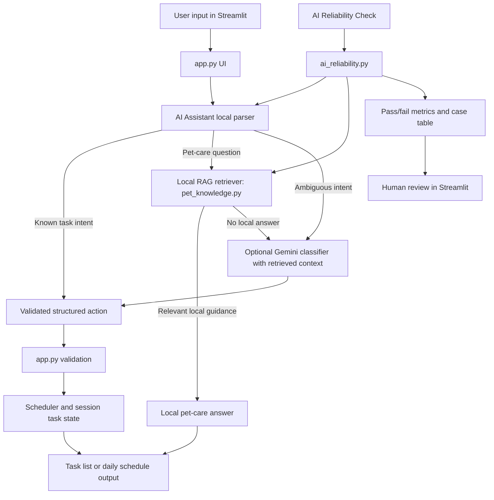

# PawPal+

PawPal+ is a Streamlit application and Python scheduling engine for daily pet care planning. It helps a pet owner capture care tasks, manage recurring work, detect timing conflicts, and build a day plan that respects limited available time.

The project is split into a UI layer in `app.py`, a scheduling domain model in `pawpal_system.py`, local AI support modules, and a pytest suite.

## 📸 Demo


## Original Project

The original Modules 1-3 project was PawPal+, a pet-care scheduler focused on helping an owner add care tasks, track pet and owner constraints, detect timing conflicts, and generate a daily care plan. Its core capabilities were task management, recurring task handling, priority-based scheduling, and conflict detection. The AI extension keeps that scheduler as the source of truth while adding natural-language task control and built-in reliability checks.

## Submission Artifacts

- Functional code is included in this repository.
- System architecture is documented in the Mermaid diagram below and in `current_design.md`.
- Demo screenshot and UML image are stored in `assets/diagrams/`.
- AI reflections, limitations, bias, misuse prevention, and testing results are summarized in `model_card.md`.
- Replace `YOUR_LOOM_LINK_HERE` in the Presentation And Portfolio section with the final Loom walkthrough link before submission.

## Features

- Streamlit dashboard for owner and pet setup, task entry, task review, filtering, sorting, completion, removal, and schedule generation.
- Priority-first greedy scheduling: `generate_plan()` filters out completed tasks, sorts remaining tasks by priority (`1` highest, `3` lowest), breaks ties by shortest duration first, and accepts each task if it fits within the remaining time budget.
- Exact-fit support: tasks that match the remaining available minutes exactly are included in the plan.
- Conflict detection with interval overlap logic: `detect_conflicts()` converts `start_time` values to minutes since midnight and flags overlaps while correctly ignoring back-to-back tasks.
- Cross-pet conflict detection in the backend: `detect_conflicts(other=...)` can compare schedules across two pets owned by the same person.
- Recurring task regeneration: completing a `daily` or `weekly` task creates the next occurrence with the correct due date using `timedelta`.
- Duplicate protection: `add_task()` blocks duplicate incomplete task names while still allowing a task name to be reused after the prior task is completed.
- Filtering and sorting utilities: the backend supports filtering by completion state and pet name, and the UI supports sorting by default priority order or shortest duration.
- Clear schedule outputs: the UI shows time-budget metrics, scheduled tasks, excluded tasks, and conflict warnings so the result is easy to review.
- AI Reliability Evaluation: built-in checks verify that the AI Assistant returns correct structured actions, avoids unnecessary Gemini calls, and handles quota errors safely.
- AI Assistant with local-first parsing: most task commands (add, remove, complete, list) are handled locally with zero API calls. Gemini is used only as a lightweight intent classifier for ambiguous requests. All user-facing messages are generated locally.
- Local RAG for pet-care Q&A: a curated knowledge base with species-specific entries (exercise, feeding, grooming, health, training) answers common pet-care questions without any API calls. When Gemini is called, retrieved knowledge is injected into the prompt for grounded answers.

## How It Works

### Core data model

- `Owner` stores the owner's name and daily time available.
- `Pet` stores the pet's basic identity.
- `Task` stores the task name, duration, priority, completion state, recurrence, optional due date, and optional start time.
- `Scheduler` owns the task list and contains the scheduling, filtering, recurrence, and conflict-detection logic.

### Scheduling algorithm

The planner uses a greedy algorithm. It evaluates incomplete tasks in priority order, breaks ties by shortest duration, and adds tasks one by one while the total stays within the owner's time limit. This makes the schedule predictable and ensures higher-priority work is considered first, even if that can leave some unused time.

### Conflict algorithm

When a task has a `start_time`, the scheduler treats it as a time window `[start, end)`. Two tasks conflict only when those windows overlap. This means a task ending at `07:10` and another starting at `07:10` are not treated as a conflict.

### AI Assistant

The AI Assistant uses a local-first architecture. Most requests — adding tasks, removing tasks, marking tasks complete, listing tasks — are parsed locally using regex-based intent matching with zero Gemini API calls. Natural phrasing like "I need to walk my dog. It will take 30 minutes and is medium priority" is handled entirely offline. When local parsing cannot determine the intent, Gemini acts as a lightweight classifier only: a minimal prompt (~200 tokens) asks it to return an action name and extracted fields, not prose. All user-facing messages are generated locally from templates. The app validates every suggestion before applying it — AI proposes, the Scheduler decides.

### AI Reliability Evaluation

PawPal+ includes an integrated reliability/testing system in the main Streamlit app. The "AI Reliability Check" runs deterministic prompts against the assistant and reports total checks, pass count, pass rate, capability category, and case-level results. The default check matches the current local-first design: task creation, natural add phrasing, completion, removal, task listing, schedule guidance, and missing-key guardrails. It does not call Gemini, preserving the free tier. An optional live Gemini smoke test can validate the API-backed path when quota is available.

## System Diagram



### Architecture Overview

User input starts in the Streamlit UI. The AI Assistant first tries to classify common task commands locally, which avoids unnecessary API calls. Pet-care questions are answered from `pet_knowledge.py` when the local RAG retriever finds relevant curated guidance. If a request is too ambiguous for local parsing or local RAG, Gemini can classify the intent with retrieved context. The app validates the action before changing task state, and the Scheduler remains responsible for planning, recurrence, and conflict logic. Human review happens through the visible task list, schedule output, and the AI Reliability Check results.

## Sample Interactions

| User input | AI result | Why it matters |
|------------|-----------|----------------|
| `Add a daily 20 minute morning walk for Mochi at 8am high priority` | Returns `add_task` locally with no Gemini call. | Shows natural-language task creation while preserving free-tier quota. |
| `Mark morning walk done` | Returns `complete_task` for the matching task. | Shows the assistant can map plain English to a safe app action. |
| `How much exercise does my dog need?` | Returns `answer_question` from local RAG. | Shows retrieval from curated pet-care knowledge without an API call. |
| `Run AI Reliability Check` | Displays pass rate, capability categories, and a case table. | Shows the project tests its AI behavior inside the main app. |

## Design Decisions

- **Local-first AI:** Common task actions are parsed with local rules so the app still works when Gemini free-tier quota is unavailable.
- **Local RAG before Gemini:** Common pet-care questions are answered from a curated knowledge base first, keeping answers grounded and free-tier friendly.
- **Gemini as fallback classifier:** Gemini is used only for ambiguous requests instead of generating every response, reducing token usage and 429 failures.
- **Scheduler as source of truth:** AI proposes structured actions, but `app.py` validates them and `Scheduler` handles planning rules.
- **Integrated reliability checks:** The AI Reliability Check is part of the Streamlit app, not just a standalone test script, so users can inspect AI behavior directly.

## Running the App

### Requirements

- Python 3.10 or newer
- `pip`

### Setup

```bash
python -m venv .venv
```

Activate the virtual environment:

```bash
# Windows
.\.venv\Scripts\activate

# macOS / Linux
source .venv/bin/activate
```

Install dependencies:

```bash
pip install -r requirements.txt
```

Set your Gemini API key:

Create a `.env` file in the project root (or set the environment variable directly):

```bash
GOOGLE_API_KEY=your-api-key-here
```

Get a free API key at https://aistudio.google.com/apikey

### Start the Streamlit UI

```bash
python -m streamlit run app.py
```

Streamlit will print a local URL, typically `http://localhost:8501`.

## Using the App

1. Enter owner details and daily time available.
2. Enter pet details.
3. Add tasks with duration, priority, optional recurrence, and optional start time.
4. Review tasks in the task list, then filter or sort them as needed.
5. Mark tasks done or remove them from the list.
6. Click `Generate schedule` to run conflict detection and build the daily plan.
7. Review scheduled tasks, excluded tasks, and time-budget metrics.
8. Use the AI Assistant to add tasks in plain English, ask pet-care questions, or get schedule advice.
9. Open "AI Reliability Check" to verify assistant behavior and rubric alignment.

## Testing

Run the automated tests with:

```bash
python -m pytest tests/ -v
```

The suite currently contains 39 tests covering:

- task addition
- time-budget enforcement
- priority ordering
- shortest-duration tie breaking
- exact-fit scheduling
- skipping completed tasks
- daily and weekly recurrence
- duplicate prevention
- same-name reuse after completion
- single-pet and cross-pet conflict detection
- non-overlapping back-to-back tasks
- filtering by pet name
- AI assistant context building, local-first parsing, local RAG, rate limiting, and error handling
- pet-care knowledge base retrieval, species filtering, and Gemini context formatting
- AI reliability evaluation scoring, no-API default behavior, and live Gemini failure isolation

This project satisfies the advanced AI guideline through a **Reliability or Testing System** integrated into the main application. The reliability check measures whether the AI Assistant produces the expected structured actions and whether default checks avoid unnecessary Gemini usage.

### Testing Summary

The current automated suite passes with `39 passed`. Scheduler tests verify task addition, recurring tasks, conflict detection, filtering, and the priority-first scheduling algorithm. AI assistant tests verify local parsing, local RAG Q&A, Gemini fallback error handling, rate limiting, and quota-safe behavior. Knowledge base tests verify retrieval scoring, species filtering, and Gemini context formatting. AI reliability tests verify that the in-app reliability check reports expected actions, avoids Gemini by default, and isolates optional live Gemini failures such as 429 quota errors.

## Reflection And Ethics

**Limitations and bias:** The local parser is intentionally simple and regex-based, so it can miss unusual phrasing or interpret ambiguous requests incorrectly. Gemini can also misclassify ambiguous text, so the app validates every action before applying it.

**Misuse prevention:** PawPal+ should not be used as veterinary advice or emergency medical guidance. The app is designed for scheduling and organizing care tasks, not diagnosing health issues. Risk is reduced by keeping Gemini as a classifier, validating task changes, and leaving final decisions to the human owner.

**Reliability surprise:** The biggest surprise was that Gemini free-tier `429 RESOURCE_EXHAUSTED` errors could happen even with a fresh API key and fresh AI Studio project. That led to the local-first design and an in-app reliability check that can run without Gemini quota.

**AI collaboration:** A helpful AI suggestion was adding a reliability evaluation system so the project could prove the assistant works. A flawed suggestion was relying too heavily on Gemini for every interaction, which caused quota problems and made the app less dependable.

## Project Structure

```text
.
|-- app.py
|-- ai_assistant.py
|-- ai_reliability.py
|-- assets/
|   `-- diagrams/
|       |-- pawpal_ui.png
|       `-- uml_final.png
|-- pet_knowledge.py
|-- pawpal_system.py
|-- tests/
|   |-- test_pawpal.py
|   |-- test_ai_assistant.py
|   |-- test_ai_reliability.py
|   |-- test_pet_knowledge.py
|-- main.py
|-- model_card.md
|-- README.md
|-- requirements.txt
|-- initial_design.md
|-- current_design.md
|-- reflection.md
`-- docs/
```

### File guide

- `app.py`: Streamlit interface for entering tasks and generating a schedule.
- `ai_assistant.py`: local-first intent parser with Gemini classifier fallback.
- `ai_reliability.py`: integrated reliability evaluation harness for AI assistant behavior.
- `assets/diagrams/`: demo screenshot and UML/system diagram image assets.
- `pet_knowledge.py`: curated pet-care knowledge base with keyword-based retrieval (local RAG).
- `pawpal_system.py`: domain classes and scheduling logic.
- `tests/test_pawpal.py`: automated verification of core scheduler behavior.
- `tests/test_ai_assistant.py`: tests for context building, rate limiting, and error handling.
- `tests/test_ai_reliability.py`: tests for the AI reliability evaluation system.
- `tests/test_pet_knowledge.py`: tests for knowledge base retrieval and formatting.
- `main.py`: scriptable demo for exercising the backend without Streamlit.
- `model_card.md`: standardized AI documentation covering capabilities, limitations, bias, misuse prevention, testing, and AI collaboration.
- `initial_design.md`: early design notes.
- `current_design.md`: updated design summary aligned to the implemented system.
- `reflection.md`: project reflection and testing notes.
- `assets/diagrams/pawpal_ui.png`: screenshot used in this README demo section.
- `assets/diagrams/uml_final.png`: final UML diagram image for the project.

## Notes and Current Scope

- Task data is stored in Streamlit session state, not a database. Restarting the app clears the in-memory UI state.
- The current Streamlit UI manages one pet at a time, while cross-pet conflict detection is available through the backend API and test suite.
- The backend also supports a plain-text plan explanation through `Scheduler.explain_plan()`, which is useful for console output and debugging.

## Presentation And Portfolio

- GitHub Repository: [PawPal+](https://github.com/gbw30/ai110-module2show-pawpal-starter)
- Loom Walkthrough: [Video Demo](https://www.loom.com/share/25faabd2dfd64407b728827db13fe761)

Before final submission, make sure the repository is public, final changes are committed and pushed, and the Loom placeholder above has been replaced with the actual walkthrough link. The walkthrough should show 2-3 example inputs, local RAG/AI behavior, the reliability check, and clear outputs.

### Portfolio Reflection

PawPal+ shows my ability to build an AI-assisted application that is practical, reliable, and user-focused. I designed the AI system to be local-first, quota-safe, and testable instead of relying on an external model for every interaction. This project reflects how I approach AI engineering: use AI where it adds value, validate its outputs, and build guardrails so the product still works when the model or API is unavailable.
