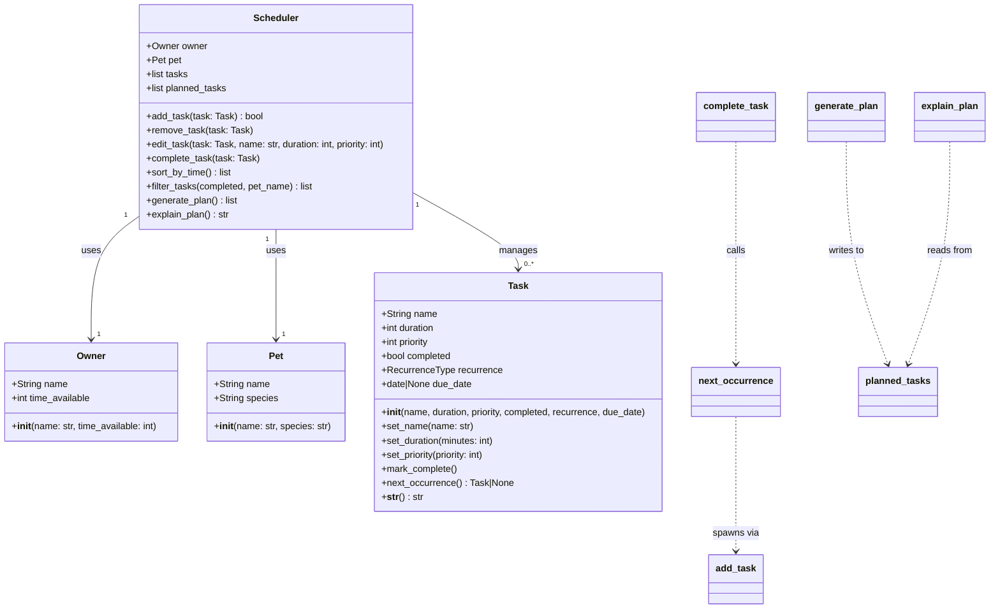

# PawPal+ Current System Design

## Class Diagram

## Design Notes

- Architecture upgraded from MVP to full product.
- `RecurrenceType` is `Literal["daily", "weekly"] | None`. Daily tasks recur
  `today + 1 day`, weekly tasks recur `today + 7 days` using `timedelta`.
- `Task.next_occurrence()` is responsible for producing the next Task instance.
  `Scheduler.complete_task()` calls it and adds the result — keeping recurrence
  logic in Task and lifecycle coordination in Scheduler.
- `add_task()` duplicate check was updated: it blocks a new task only if an
  **incomplete** task with the same name already exists, allowing recurrence
  instances to be added after the previous one is completed.
- `generate_plan()` filters out completed tasks before scheduling.
- `planned_tasks` stores the output of `generate_plan()` so `explain_plan()`
  reads a stable snapshot without re-running scheduling logic.
- `filter_tasks()` accepts `completed` and/or `pet_name`; either can be omitted.
- `sort_by_time()` sorts `self.tasks` in place by duration (shortest first).
