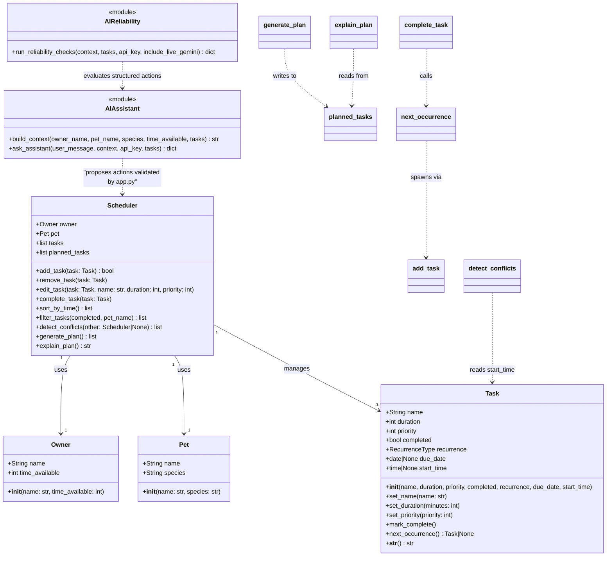

# PawPal+ Current System Design

## Class Diagram

## Design Notes

- Architecture upgraded from MVP to full product.
- `RecurrenceType` is `Literal["daily", "weekly"] | None`. Daily tasks recur
  `today + 1 day`, weekly tasks recur `today + 7 days` using `timedelta`.
- `Task.next_occurrence()` is responsible for producing the next Task instance.
  `Scheduler.complete_task()` calls it and adds the result — keeping recurrence
  logic in Task and lifecycle coordination in Scheduler.
- `add_task()` duplicate check was updated: it blocks a new task only if an
  **incomplete** task with the same name already exists, allowing recurrence
  instances to be added after the previous one is completed.
- `generate_plan()` filters out completed tasks before scheduling.
- `planned_tasks` stores the output of `generate_plan()` so `explain_plan()`
  reads a stable snapshot without re-running scheduling logic.
- `filter_tasks()` accepts `completed` and/or `pet_name`; either can be omitted.
- `sort_by_time()` sorts `self.tasks` in place by duration (shortest first).
- `Task.start_time` is an optional `datetime.time` used exclusively by
  `detect_conflicts()`. Tasks without a start time are ignored by conflict checks.
- `detect_conflicts(other=None)` uses an interval overlap formula
  (`a_start < b_end and b_start < a_end`) with `itertools.combinations` to check
  all task pairs. Passing a second `Scheduler` via `other` extends the check across
  two pets (cross-pet conflict detection).

## UI Layer (app.py)

`app.py` is the Streamlit frontend. It stores tasks as plain dicts in
`st.session_state` and converts them to `Task` objects only when needed via
`build_scheduler()`. Key UI components:

- **`st.metric`** — task count summary (Total / Incomplete / Completed) and schedule
  time budget (Available / Scheduled / Remaining).
- **`st.tabs`** — separates the read-only Overview (`st.dataframe`) from the
  interactive Manage Tasks view (Done / Remove buttons).
- **`st.dataframe`** — renders filtered/sorted task lists and the generated schedule
  as structured tables.
- **`st.success` / `st.warning` / `st.error`** — conflict alerts, schedule status,
  and excluded-task notices use the appropriate severity level.
- **AI Reliability Check expander** runs deterministic assistant checks inside the
  main app and shows total checks, pass count, pass rate, and case details.
- Recurrence spawning is handled in the UI's Done button handler: when a recurring
  task is marked complete, a new task dict with the correct `due_date` is appended
  to `st.session_state.tasks` before `st.rerun()`.

## AI Assistant Layer (ai_assistant.py)

`ai_assistant.py` is a pure-Python module with no Streamlit dependency. It uses a
local-first architecture where most requests are handled by regex-based intent
parsing, and Gemini is used only as a lightweight intent classifier for ambiguous
requests.

- **Local-first parsing:** `_local_task_response()` handles add, remove, complete,
  list, and schedule intents using regex patterns. Natural phrasing like "I need
  to walk my dog. It will take 30 minutes" is parsed locally without any API call.
  This covers ~90% of typical user requests.
- **Gemini as classifier only:** When local parsing cannot determine the intent,
  a minimal `CLASSIFIER_PROMPT` (~200 tokens) asks Gemini to return only an action
  name and extracted fields — no prose generation. `max_output_tokens` is 150 with
  `temperature` 0.0 for deterministic classification.
- **Local message generation:** All user-facing messages are generated by
  `_format_message()` templates, not by Gemini. For `answer_question` actions,
  Gemini returns a 1-2 sentence answer in the `answer` field.
- **`build_context()`** serializes the current PawPal state (owner, pet, tasks)
  into a text block injected into the Gemini prompt.
- **Rate limiting and quota guardrails:** Gemini-backed calls use a 10-second
  cooldown, 429 handling with retry timing, and sanitized quota details.
- **Workflow:** User types a request → local parser attempts to handle it → if
  unmatched, one minimal Gemini call classifies the intent → `app.py` validates
  the structured payload → valid changes are applied to `st.session_state.tasks`
  → a locally generated message is displayed. Gemini never mutates session state.

Supported actions: `add_task`, `remove_task`, `complete_task`, `edit_task`,
`generate_schedule`, `answer_question`.

## AI Reliability Layer (ai_reliability.py)

`ai_reliability.py` is a pure-Python evaluation module that checks whether the
AI Assistant returns expected structured actions.

- **`run_reliability_checks()`** runs deterministic prompts for add, complete,
  remove, and list behavior, then reports total checks, passed checks, failed
  checks, pass rate, and case-level details.
- **Free-tier friendly by default:** local checks do not call Gemini, so the
  reliability feature can be used even when free-tier quota is exhausted.
- **Optional live smoke test:** when explicitly enabled, one Gemini-backed
  question validates the API path and safely reports quota/API failures without
  invalidating the deterministic local cases.
