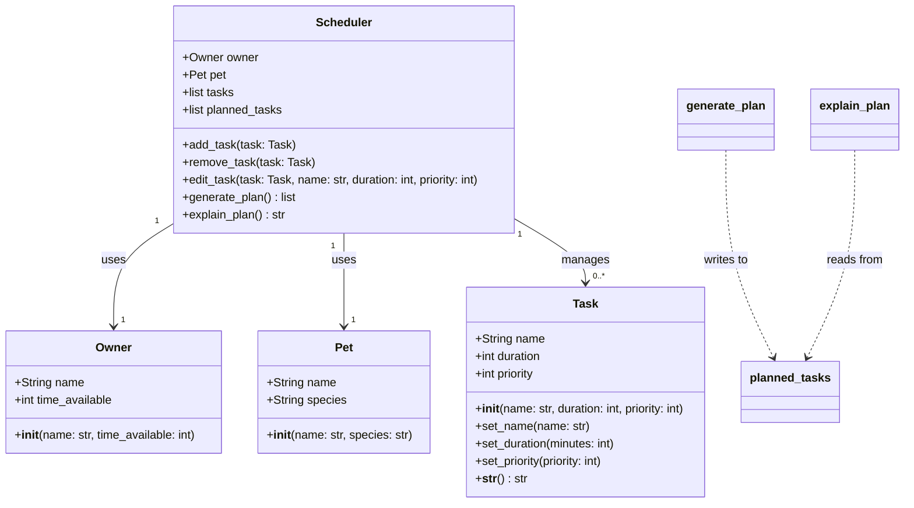

# PawPal+ Current System Design

## Class Diagram

## Design Notes

- `planned_tasks` was added to `Scheduler` after the initial skeleton review.
  It stores the output of `generate_plan()` so that `explain_plan()` has a stable
  reference without needing to re-run scheduling logic.
- `Owner` and `Pet` use constructor-only initialization — no setters needed since
  they are data containers set once via the UI form.
- `Task` retains setters to support the edit task flow after creation.
- `remove_task()` and `edit_task()` match by task name, not object identity,
  to avoid fragile reference comparisons in Streamlit's session state.
