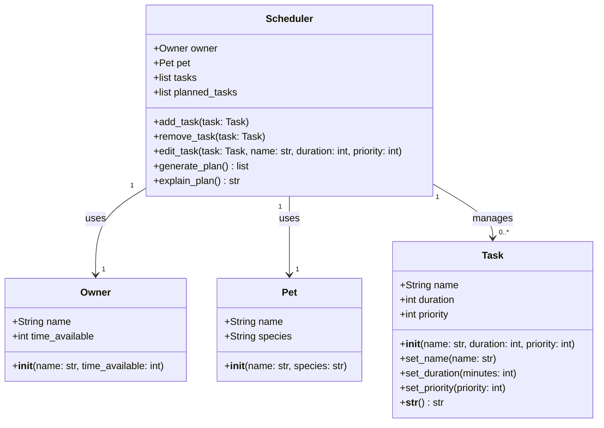

# PawPal+ Initial System Design

## Class Diagram

```mermaid
classDiagram
    class Owner {
        +String name
        +int time_available
        +__init__(name: str, time_available: int)
    }

    class Pet {
        +String name
        +String species
        +__init__(name: str, species: str)
    }

    class Task {
        +String name
        +int duration
        +int priority
        +__init__(name: str, duration: int, priority: int)
        +set_name(name: str)
        +set_duration(minutes: int)
        +set_priority(priority: int)
        +__str__() str
    }

    class Scheduler {
        +Owner owner
        +Pet pet
        +list tasks
        +list planned_tasks
        +add_task(task: Task)
        +remove_task(task: Task)
        +edit_task(task: Task, name: str, duration: int, priority: int)
        +generate_plan() list
        +explain_plan() str
    }

    Scheduler "1" --> "1" Owner : uses
    Scheduler "1" --> "1" Pet : uses
    Scheduler "1" --> "0..*" Task : manages
```
